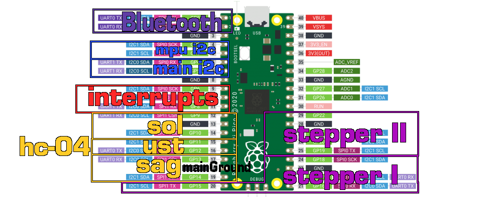

 

  

  <h3 align="center">mapping robot with ultrasonic ditance sensor</h3>

  

    
     
     
  

## About The Project

Mapping robot with modified tréamux

## Built With

* Pi pico sdk
* Mpu6050 DMP library from I2CDev

## License

Distributed under the MIT License. See [LICENSE](https://github.com/Leonidas213/DonaRomba/blob/main/LICENSE.md) for more information.

## Authors

* **Bahri Berkant İçöz** - *Student* - *Author*
* **Umut Kaya** - *Student* - *Author*
* **Enes Yuvarlan** - *Student*  - *Author*

## Acknowledgements

* [I2cDevlib](https://github.com/jrowberg/i2cdevlib)
* [Explorino](https://github.com/giomalt/explorino)

